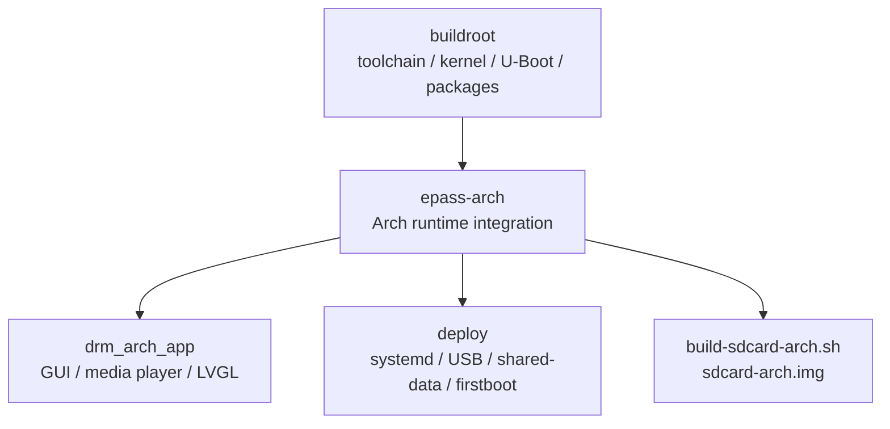

# ArkEPass Arch Runtime Integration

For the Simplified Chinese version, see
[README.md](README.md).

`epass-arch` is the Arch Linux ARM runtime integration layer for ArkEPass.
It sits between the top-level Buildroot firmware tree and the maintained GUI
application `drm_arch_app`.

> Mainline note
>
> The current maintained GUI entry is `drm_arch_app`.



## Positioning

This directory is not a standalone firmware repository and not a pure
application repository either.

It is responsible for three things:

1. Maintaining the current GUI source tree: `drm_arch_app/`
2. Providing Arch runtime deployment assets: `deploy/`
3. Assembling an Arch SD image from Buildroot outputs and the Arch rootfs

In short:

- `buildroot` owns the low-level firmware build
- `drm_app_neo` represents an app-focused repository shape
- `epass-arch` owns the Arch runtime-facing integration work

## Repository Relationship

### 1. `buildroot`

Upstream in the current tree:

- Toolchain, kernel, U-Boot, target libraries
- Board config, DTS, kernel/U-Boot patches
- Buildroot package integration for `drm_arch_app`
- `output/host`, `output/target`, `output/images`

Typical locations:

- `../board/rhodesisland/epass/`
- `../package/drm_arch_app/`
- `../output/`

### 2. `drm_app_neo`

`drm_app_neo` is best understood as an application-oriented repository:

- focuses on the DRM/LVGL/CedarX player itself
- useful when the main concern is media/UI logic
- does not carry the full Arch runtime integration boundary used here

Reference:

- <https://github.com/rhodesepass/drm_app_neo>

### 3. `epass-arch`

`epass-arch` is where the Arch runtime behavior is defined:

- GUI source tree
- deploy scripts and systemd units
- shared-data layout
- USB gadget runtime behavior
- firstboot / resize / fallback / boot animation flow
- Arch SD image assembly

Reference:

- <https://github.com/rhodesepass/buildroot>

## System Comparison

| Repository | Best for | What it owns | What it does not own |
| --- | --- | --- | --- |
| `buildroot` | Firmware build, BSP, package integration | toolchain, kernel, U-Boot, board config, package graph, target rootfs | Arch runtime policy inside `epass-arch/` |
| `drm_app_neo` | App-focused media/UI work | player/app logic, DRM/LVGL/CedarX app shape | full Arch deploy/systemd/shared-data/image assembly |
| `epass-arch` | Current ArkEPass Arch runtime maintenance | GUI + deploy + runtime scripts + image assembly | low-level BSP ownership and full Buildroot core |

### Which one is better?

It depends on the job:

- For GUI/player iteration, `drm_app_neo` is more focused.
- For board bring-up and firmware build ownership, `buildroot` is the source
  of truth.
- For the current ArkEPass Arch runtime path, `epass-arch` is the best entry
  point because it integrates GUI, deploy, systemd, shared-data, USB, boot
  flow, and SD image assembly in one place.

## What `epass-arch` Contains

```text
epass-arch/
├── build-sdcard-arch.sh
├── build_drm_arch_app.sh
├── build_lvgl.sh
├── build_python311.sh
├── deploy/
├── drm_arch_app/
├── python-build/
├── python-install/
├── third_party/
└── ui_design/
```

### `drm_arch_app/`

The maintained GUI application.

- DRM + LVGL + CedarX media path
- app logic, overlay, player, IPC, settings
- current compiled UI is under `generated_ui/`

See also:

- [drm_arch_app/README.md](drm_arch_app/README.md)
- [drm_arch_app/docs/application_structure.md](drm_arch_app/docs/application_structure.md)

### `deploy/`

Arch runtime deployment assets.

This is not just a "scripts" folder. It defines runtime policy:

- `drm-arch-app.service`
- boot animation and GUI handoff
- GUI preflight and fallback
- shared-data mount and bind mapping
- USB gadget mode restore/switch
- firstboot, resize, bootenv flow

### `build-sdcard-arch.sh`

Builds `sdcard-arch.img` from:

- Arch Linux ARM rootfs tarball
- Buildroot outputs
- deploy files
- `drm_arch_app`

### `ui_design/epass_eez/`

Source of truth for EEZ Studio UI design.

- edit the EEZ project here
- export to `drm_arch_app/generated_ui/`

Do not edit `generated_ui/` directly.

See also:

- [ui_design/epass_eez/README.md](ui_design/epass_eez/README.md)

### `third_party/lvgl/`

Shared LVGL source used by the app build.

- treated as a shared dependency
- not the normal day-to-day entry point for feature work

### `python-build/` and `python-install/`

Support directories for bundling Python runtime content into the Arch image.

## Build and Development Flow

This repository depends on the parent Buildroot tree.

### 1. Full Buildroot bootstrap

Run from the Buildroot root:

```bash
make rhodesisland_epass_defconfig
make -j$(nproc)
```

This gives you:

- toolchain
- kernel and DT artifacts
- U-Boot
- target libraries and package outputs
- `output/host`, `output/target`, `output/images`

### 2. GUI iteration

Preferred path:

```bash
./epass-arch/build_drm_arch_app.sh
```

Or through Buildroot:

```bash
make drm_arch_app
```

This path is for:

- `drm_arch_app/src/*`
- media/UI/application logic changes

### 3. UI design export

Edit the EEZ project under:

```text
epass-arch/ui_design/epass_eez/
```

Then export to:

```text
epass-arch/drm_arch_app/generated_ui/
```

Runtime build only compiles the generated UI tree.

### 4. SD image assembly

Prepare the Arch rootfs tarball in the Buildroot root:

```text
ArchLinuxARM-armv5-latest.tar.gz
```

Then run:

```bash
sudo ./epass-arch/build-sdcard-arch.sh
```

Output:

```text
sdcard-arch.img
```

Native Linux is recommended for the rootful image build path.

## Runtime Architecture

### High-level flow

1. `build-sdcard-arch.sh` assembles boot, rootfs, data, deploy files,
   services, resources and `drm_arch_app`
2. systemd starts the runtime chain on device
3. shared-data, USB mode and screen detection are prepared before GUI startup
4. `drm-arch-app.service` launches `drm-arch-app-runner.sh`
5. the runner imports inbox apps, starts `drm_arch_app`, and interprets exit
   codes

### Why this repo is system-heavy

`drm_arch_app` is only the foreground GUI process.
The surrounding runtime behavior is owned by `epass-arch`:

- `drm-arch-app.service` has `Requires`, `Wants`, `ExecCondition`,
  `ExecStartPre`, and `OnFailure`
- `/assets`, `/dispimg`, `/root/themes` are provided by shared-data mapping
- USB modes are applied by `epass-usb-mode` and `usbctl.sh`
- firstboot and resize are system state-machine flows
- fallback UI and boot animation are system-managed

### Key runtime pieces

- `drm-arch-app.service`
  - depends on `screen-detect.service`
  - wants `epass-data-mount.service` and `epass-usb-mode.service`
  - runs `epass-gui-should-start.sh` and `epass-gui-preflight.sh`
  - falls back to `epass-gui-fallback.service` on failure

- `epass-data-mount.sh`
  - mounts `EPASSDATA`
  - binds shared content into `/assets`, `/dispimg`, `/root/themes`

- `epass-usb-mode` + `usbctl.sh`
  - restore and switch gadget modes such as MTP / serial / RNDIS

- `epass-firstboot-select`
  - blocks the normal GUI path during hardware/screen selection

- `epass-resize-init`
  - handles early resize flow before normal runtime

- `drm-arch-app-runner.sh`
  - imports inbox apps
  - launches the GUI binary
  - handles restart / foreground app / poweroff / srgn_config exits

## Developer Entry Points

### If you want to change GUI logic

Go to:

```text
drm_arch_app/src/
```

### If you want to change UI design

Go to:

```text
ui_design/epass_eez/
```

Then export to:

```text
drm_arch_app/generated_ui/
```

### If you want to change startup, USB, shared-data, fallback, firstboot

Go to:

```text
deploy/
```

### If you want to change board-level kernel/U-Boot/package integration

Go to the parent Buildroot tree:

```text
../board/rhodesisland/epass/
../package/drm_arch_app/
```

That work is not primarily owned by `epass-arch/`.

## Related Documents

- [drm_arch_app README](drm_arch_app/README.md)
- [Application structure](drm_arch_app/docs/application_structure.md)
- [EEZ project README](ui_design/epass_eez/README.md)

## Recommended Entry Point

If you are trying to understand the current ArkEPass Arch runtime path, start
here first.

Use `drm_app_neo` when you want to study the player/app side in a more focused
form.

Use `buildroot` when you need the authoritative low-level firmware source of
truth.
