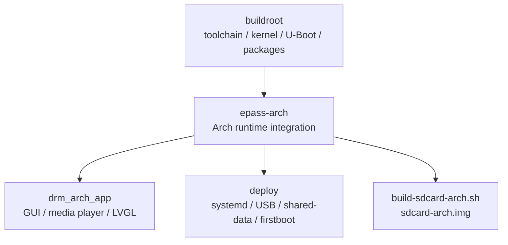

# ArkEPass Arch 运行时集成

英文版本见 [README.md](README.md)。

`epass-arch` 是 ArkEPass 当前 Arch Linux ARM 主线镜像的运行时集成层。
它位于上层 Buildroot 固件树与当前维护的 GUI 应用 `drm_arch_app` 之间，
负责应用集成、systemd 启动链、运行时脚本、共享数据分区和 SD 镜像装配。

> 主线说明
>
> 当前维护的 GUI 主入口是 `drm_arch_app`。



## 项目定位

这个目录既不是完整的 BSP/固件主仓，也不是单纯的 GUI 仓库。

它主要承担三件事：

1. 维护当前 GUI 源码：`drm_arch_app/`
2. 提供 Arch 运行时部署内容：`deploy/`
3. 基于 Buildroot 产物和 Arch rootfs 组装 SD 镜像

简而言之：

- `buildroot` 负责底层固件构建
- `drm_app_neo` 更像应用层仓库
- `epass-arch` 负责面向 Arch 运行时的系统集成

## 与其它仓库的关系

### 1. `buildroot`

在当前工程里，`buildroot` 负责：

- 工具链、内核、U-Boot、目标库
- 板级配置、DTS、kernel/U-Boot patch
- `drm_arch_app` 的 Buildroot 包接入
- `output/host`、`output/target`、`output/images`

典型位置：

- `../board/rhodesisland/epass/`
- `../package/drm_arch_app/`
- `../output/`

### 2. `drm_app_neo`

`drm_app_neo` 更适合理解为应用层仓库：

- 重点是 DRM/LVGL/CedarX 播放器本体
- 更适合媒体播放和 UI 逻辑开发
- 不承担这里这套 Arch 运行时集成边界

参考：

- <https://github.com/rhodesepass/drm_app_neo>

### 3. `epass-arch`

`epass-arch` 定义的是 Arch 运行时行为：

- GUI 源码
- deploy 脚本与 systemd unit
- 共享数据分区布局
- USB gadget 运行时行为
- firstboot / resize / fallback / 启动动画
- Arch SD 镜像装配

参考：

- <https://github.com/rhodesepass/buildroot>

## 系统层对比

| 仓库 | 更适合做什么 | 主要负责什么 | 不主要负责什么 |
| --- | --- | --- | --- |
| `buildroot` | 固件构建、BSP、包集成 | 工具链、内核、U-Boot、板级配置、包图、目标 rootfs | `epass-arch/` 内的 Arch 运行时策略 |
| `drm_app_neo` | 应用层媒体/UI 开发 | 播放器/GUI 逻辑 | 完整的 Arch deploy/systemd/shared-data/镜像装配 |
| `epass-arch` | 当前 ArkEPass Arch 主线维护 | GUI + deploy + 运行时脚本 + 镜像装配 | 底层 BSP 主维护与 Buildroot 核心本体 |

### 哪个更好一些？

要看目标：

- 如果目标是 GUI/播放器本体开发，`drm_app_neo` 更聚焦。
- 如果目标是板级 bring-up 和整机固件构建，`buildroot` 才是底层主仓。
- 如果目标是当前 ArkEPass Arch 主线运行时维护，`epass-arch` 更适合作为入口，
  因为它把 GUI、deploy、systemd、shared-data、USB、boot flow 和 SD 镜像装配
  放在了同一个运行时边界内。

## 目录与职责

```text
epass-arch/
├── build-sdcard-arch.sh
├── build_drm_arch_app.sh
├── build_lvgl.sh
├── build_python311.sh
├── deploy/
├── drm_arch_app/
├── python-build/
├── python-install/
├── third_party/
└── ui_design/
```

### `drm_arch_app/`

当前维护中的 GUI 应用：

- DRM + LVGL + CedarX 媒体链路
- app 逻辑、overlay、播放器、IPC、设置
- 当前参与编译的 UI 导出代码位于 `generated_ui/`

另见：

- [drm_arch_app/README.md](drm_arch_app/README.md)
- [drm_arch_app/docs/application_structure.md](drm_arch_app/docs/application_structure.md)

### `deploy/`

`deploy/` 不只是脚本目录，它定义了运行时策略：

- `drm-arch-app.service`
- 启动动画与 GUI 交接
- GUI preflight 与 fallback
- shared-data 挂载与 bind 映射
- USB gadget 模式恢复/切换
- firstboot、resize、bootenv 流程

### `build-sdcard-arch.sh`

它把以下内容组装成 `sdcard-arch.img`：

- Arch Linux ARM rootfs tarball
- Buildroot 产物
- deploy 文件
- `drm_arch_app`

### `ui_design/epass_eez/`

这里才是 EEZ Studio UI 设计源：

- 在这里修改 EEZ 工程
- 导出到 `drm_arch_app/generated_ui/`

不要直接手改 `generated_ui/`。

另见：

- [ui_design/epass_eez/README.md](ui_design/epass_eez/README.md)

### `third_party/lvgl/`

共享 LVGL 源码：

- 作为共享依赖存在
- 不是日常功能开发入口

### `python-build/` 和 `python-install/`

用于将 Python 运行时内容打包进 Arch 镜像的辅助目录。

## 构建与开发流程

`epass-arch` 依赖上层 Buildroot 工程，不能脱离 Buildroot 理解。

### 1. 全量 Buildroot 初始化

在 Buildroot 根目录执行：

```bash
make rhodesisland_epass_defconfig
make -j$(nproc)
```

得到的核心产物包括：

- 工具链
- 内核与设备树产物
- U-Boot
- 目标库与包输出
- `output/host`、`output/target`、`output/images`

### 2. GUI 应用迭代

优先路径：

```bash
./epass-arch/build_drm_arch_app.sh
```

或者通过 Buildroot：

```bash
make drm_arch_app
```

适用于：

- `drm_arch_app/src/*`
- 媒体/UI/应用逻辑修改

### 3. UI 设计导出

在这里修改 EEZ 工程：

```text
epass-arch/ui_design/epass_eez/
```

然后导出到：

```text
epass-arch/drm_arch_app/generated_ui/
```

运行时编译只会使用导出的 `generated_ui/`。

### 4. SD 镜像装配

先在 Buildroot 根目录准备：

```text
ArchLinuxARM-armv5-latest.tar.gz
```

然后执行：

```bash
sudo ./epass-arch/build-sdcard-arch.sh
```

输出：

```text
sdcard-arch.img
```

对于 rootful 镜像装配路径，建议使用原生 Linux 环境。

## 运行时架构

### 高层流程

1. `build-sdcard-arch.sh` 负责组装 boot、rootfs、data、deploy 文件、服务、
   资源和 `drm_arch_app`
2. 设备启动后由 systemd 拉起运行时链
3. shared-data、USB 模式、screen detect 会先于 GUI 准备完成
4. `drm-arch-app.service` 再启动 `drm-arch-app-runner.sh`
5. runner 会导入 inbox app、启动 `drm_arch_app`，并解释退出码

### 为什么它是系统层仓库

`drm_arch_app` 只是前台 GUI 进程，外围运行时行为由 `epass-arch` 负责：

- `drm-arch-app.service` 带有 `Requires`、`Wants`、`ExecCondition`、
  `ExecStartPre`、`OnFailure`
- `/assets`、`/dispimg`、`/root/themes` 来自 shared-data 映射
- USB 模式由 `epass-usb-mode` 和 `usbctl.sh` 应用
- firstboot 和 resize 是系统状态机流程
- fallback UI 与启动动画由系统管理

### 关键运行时组件

- `drm-arch-app.service`
  - 依赖 `screen-detect.service`
  - 需要 `epass-data-mount.service` 和 `epass-usb-mode.service`
  - 执行 `epass-gui-should-start.sh` 和 `epass-gui-preflight.sh`
  - 失败时回退到 `epass-gui-fallback.service`

- `epass-data-mount.sh`
  - 挂载 `EPASSDATA`
  - 将共享内容 bind 到 `/assets`、`/dispimg`、`/root/themes`

- `epass-usb-mode` + `usbctl.sh`
  - 恢复并切换 MTP / serial / RNDIS 等 gadget 模式

- `epass-firstboot-select`
  - 在硬件/屏幕选择阶段阻塞正常 GUI 路径

- `epass-resize-init`
  - 在正常运行前处理早期扩容流程

- `drm-arch-app-runner.sh`
  - 导入 inbox apps
  - 启动 GUI 二进制
  - 处理 restart / foreground app / poweroff / srgn_config 退出码

## 开发入口

### 如果要改 GUI 逻辑

去这里：

```text
drm_arch_app/src/
```

### 如果要改 UI 设计

去这里：

```text
ui_design/epass_eez/
```

然后导出到：

```text
drm_arch_app/generated_ui/
```

### 如果要改启动、USB、shared-data、fallback、firstboot

去这里：

```text
deploy/
```

### 如果要改板级 kernel/U-Boot/package 集成

去上层 Buildroot 树：

```text
../board/rhodesisland/epass/
../package/drm_arch_app/
```

这部分不属于 `epass-arch/` 的主要边界。

## 相关文档

- [drm_arch_app README](drm_arch_app/README.md)
- [Application structure](drm_arch_app/docs/application_structure.md)
- [EEZ project README](ui_design/epass_eez/README.md)

## 推荐入口结论

如果你要理解当前 ArkEPass Arch 主线运行时方案，建议先从这里开始。

当你更想研究播放器/app 本体时，优先看 `drm_app_neo`。

当你要处理底层固件构建与板级问题时，回到 `buildroot` 主仓。
