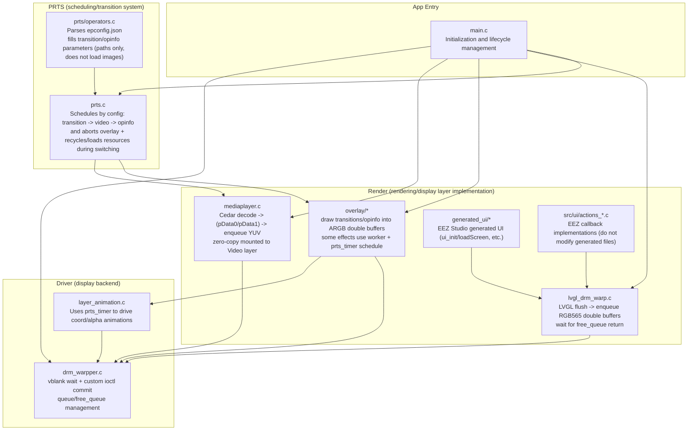
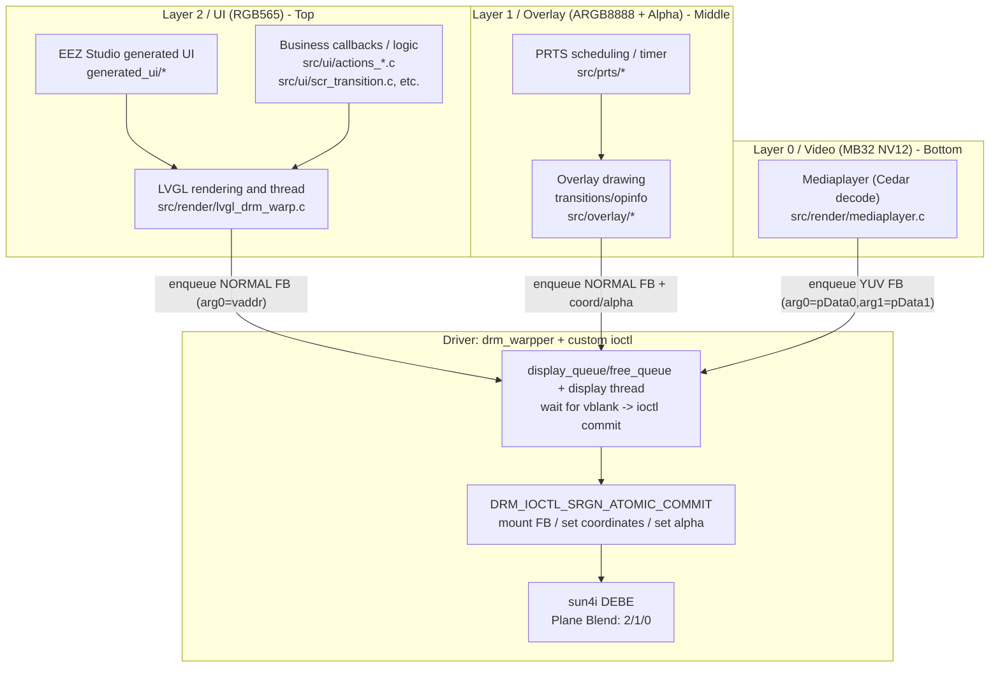

# Application Structure

## Module Breakdown

### driver display backend module

This module is mainly responsible for actually displaying the "layer update requests" submitted by each business module on the screen:

- DRM-based plane initialization (modeset) and buffer allocation (dumb buffer)
- Maintaining the `display_queue/free_queue` for each layer
- Creating the display thread: on each vblank (vsync), use the custom ioctl `DRM_IOCTL_SRGN_ATOMIC_COMMIT` to merge and submit FB mounting / coordinate updates / alpha updates

The core file in this layer is `src/driver/drm_warpper.c` (plus the ioctl definition in `src/driver/srgn_drm.h`).

### render module

This module is mainly responsible for rendering "video/overlay/ui" into buffers that can be mounted and displayed by `drm_warpper`:

- **Video (`src/render/mediaplayer.c`)**: calls Cedar for decoding, gets the decoded output user-space addresses `pData0/pData1`, zero-copy enqueues them to the video layer, and finally `drm_warpper` feeds them to the kernel through ioctl at vblank to complete the mount
- **UI (`src/render/lvgl_drm_warp.c`)**: writes LVGL flush output directly into RGB565 double buffers and enqueues them; also waits for buffer return after vsync through `free_queue`
- **Overlay (`src/overlay/*`)**: draws transitions / operator info into ARGB double buffers; time-consuming per-frame effects use the overlay worker to avoid blocking the PRTS timer callback

### UI module

The UI is mainly generated by EEZ Studio and runs in the LVGL thread:

- **Generated code**: `generated_ui/*` (`ui_init/loadScreen`, screens/images/styles, etc.)
- **Business callbacks / logic**: `src/ui/actions_*.c`, `src/ui/scr_transition.c`, `src/ui/filemanager.c`, etc.

Note: **do not modify the generated files in `generated_ui/*` directly**. Update `../ui_design/epass_eez/epass.eez-project` and then re-export, otherwise the generated linkage may be broken.

### PRTS module

Playlist Routing & Transition System, responsible for orchestrating operator resources and playback flow:

- Parses operator `epconfig.json` (`src/prts/operators.c`) and obtains `transition_in/transition_loop/opinfo` parameters (image fields only store paths; actual loading is performed by the overlay layer)
- In `src/prts/prts.c`, schedules execution according to configuration: transition -> switch video (`mediaplayer`) -> opinfo
- During operator switching, it calls `overlay_abort()` to request termination of the overlay and waits for cleanup to complete inside the worker before loading and scheduling resources for the new operator

### utils module

This module mainly provides common utilities and infrastructure: logging (`log`), queues (`spsc_queue`), timers (`prts_timer`), JSON/UUID, etc.

## Structure by Display Layer (Plane)

This project actually uses **3 layers / planes**:

- **Layer 0: Video** (`MB32 NV12`, used for video decode output, from DEFE)
- **Layer 1: Overlay** (`ARGB8888`, used for transition / operator info overlay drawing, can use pixel alpha or register alpha)
- **Layer 2: UI** (`RGB565`, used for LVGL UI)

The actual blend order is **2/1/0 from top to bottom**, handled by sun4i **DEBE**.

### Key limitations of sun4i / DEBE

- Although there are physically **4 layers**, at the same time it supports at most:
  - **1 video layer** (data imported from DEFE, used for video decode output)
  - **1 layer with transparency** (RGBA pixel alpha or register alpha)
- The tradeoff in this project is: Video uses YUV (`MB32 NV12`), Overlay uses ARGB (takes the transparency-capable layer), and UI uses RGB565 (to avoid consuming transparency capability where possible).

For more background, see: [Custom ioctl documentation](https://ep.iccmc.cc/guide/develop/custom_ioctl.html).

### `drm_warpper` (display backend)

- `drm_warpper` is responsible for merging "display requests submitted by each layer" at **vblank** time and submitting them to the kernel in a single ioctl call to reduce modeset/register overhead.
- Basic usage by layer:
  - `drm_warpper_init_layer(layer_id, w, h, mode)` initializes the layer (queues, etc.)
  - `drm_warpper_allocate_buffer()` allocates dumb buffers (suitable for UI/Overlay double buffering; the Video layer usually does not output through this buffer type)
  - **Modeset first**: `drm_warpper_mount_layer()` (`drmModeSetPlane`) brings the layer up, then enters the fast path of "per-frame ioctl commit"
  - Per frame / per update: `drm_warpper_enqueue_display_item()` submits an item (mount FB / set coordinates / set alpha)
  - Synchronization / recycling: use `drm_warpper_dequeue_free_item()` to get the item whose previous frame has finished switching from `free_queue`, so the buffer can be reused or the decoded frame can be returned
- The kernel caches the mapping from "user-space address -> physical address", so the program resets the cache at startup to avoid leftovers from the previous run.

### Video layer (`mediaplayer`)

- `mediaplayer` gets `VideoPicture` from Cedar decoding, where `pData0/pData1` are **user-space addresses**.
- Zero-copy path: fill `pData0/pData1` into `arg0/arg1` of `DRM_SRGN_ATOMIC_COMMIT_MOUNT_FB_YUV`, enqueue to `drm_warpper`, and let the display thread submit the ioctl at vblank to complete mount/switch in the kernel.
- Decode frame recycling: `mediaplayer` retrieves old frame items from the video layer's `free_queue`, then calls `ReturnPicture()` on the stored `VideoPicture*` to avoid exhausting decoder buffers.

### UI layer (`lvgl_drm_warpper` + EEZ Studio)

- Initialization entry is in `src/render/lvgl_drm_warp.c`:
  - Allocates UI layer double buffers (RGB565) and performs modeset first
  - In the LVGL flush callback, enqueues the framebuffer, waits for buffer return after vsync through `free_queue`, then calls `lv_display_flush_ready()`
- After LVGL initialization completes, it calls the EEZ Studio generated `ui_init()` / `loadScreen()` and related functions to create the UI.
- **Do not modify generated code directly**: `generated_ui/*` is exported output from EEZ Studio. The recommended workflow is to modify `../ui_design/epass_eez/epass.eez-project` and regenerate. Project-side business logic / callbacks should be written in `src/ui/actions_*.c` and related files to avoid breaking generated linkage.
